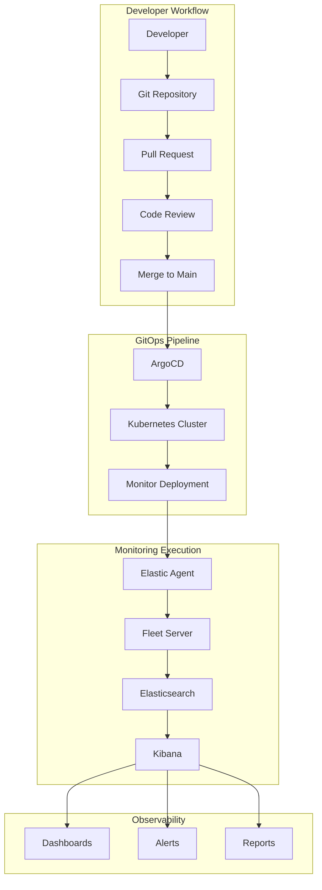
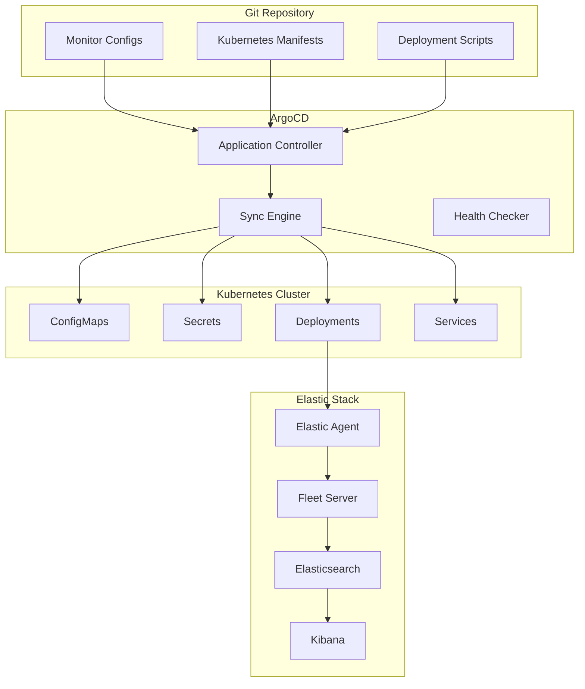

# Architecture Design Document

## Executive Summary

This document outlines the architecture for a GitOps-based Elastic synthetic monitoring solution that provides declarative configuration management, automated deployment, and comprehensive observability for synthetic monitors across multiple environments.

## Design Goals

### Primary Objectives
- **GitOps Compliance**: All configurations managed through Git with automated deployment
- **Scalability**: Support for hundreds of monitors across multiple environments
- **Reliability**: High availability and fault tolerance for monitoring infrastructure
- **Security**: Secure secrets management and access control
- **Observability**: Comprehensive monitoring of the monitoring system itself
- **Developer Experience**: Simple, intuitive configuration and deployment process

### Non-Functional Requirements
- **Performance**: Monitor deployment within 30 seconds of Git commit
- **Availability**: 99.9% uptime for monitoring infrastructure
- **Security**: Zero-trust security model with encrypted communications
- **Compliance**: Audit trail for all configuration changes
- **Maintainability**: Clear separation of concerns and modular architecture

## Architecture Overview

### High-Level Architecture



### Component Architecture



## Detailed Component Design

### 1. Configuration Management Layer

#### Monitor Configuration Schema
```yaml
apiVersion: synthetics.elastic.co/v1
kind: SyntheticMonitor
metadata:
  name: example-http-monitor
  namespace: synthetic-monitoring
  labels:
    monitor-type: http
    environment: production
    team: platform
    criticality: high
spec:
  type: http
  schedule:
    interval: 1m
  locations:
    - synthetic-monitor-default
  config:
    url: https://api.example.com/health
    method: GET
    timeout: 30s
    expectedStatus: [200]
    expectedBody:
      contains: ["status", "healthy"]
  alerting:
    enabled: true
    threshold:
      failures: 3
      timeWindow: 5m
  tags:
    - gitops-managed
    - api-health
    - critical-path
```

#### Configuration Validation
- **Schema Validation**: JSON Schema validation for all monitor configurations
- **Semantic Validation**: Business rule validation (e.g., schedule conflicts, resource limits)
- **Security Validation**: Credential and access validation
- **Dependency Validation**: Cross-monitor dependency checking

### 2. GitOps Orchestration Layer

#### ArgoCD Integration
```yaml
apiVersion: argoproj.io/v1alpha1
kind: Application
metadata:
  name: synthetic-monitoring
  namespace: argocd
spec:
  project: default
  source:
    repoURL: https://github.com/example/elastic-synthetic-gitops
    path: manifests/overlays/production
    targetRevision: HEAD
  destination:
    server: https://kubernetes.default.svc
    namespace: synthetic-monitoring
  syncPolicy:
    automated:
      prune: true
      selfHeal: true
    syncOptions:
      - CreateNamespace=true
      - RespectIgnoreDifferences=true
    retry:
      limit: 5
      backoff:
        duration: 5s
        factor: 2
        maxDuration: 3m
```

#### Sync Strategy
- **Declarative Sync**: All resources managed declaratively through Git
- **Progressive Deployment**: Staged rollout across environments
- **Health Monitoring**: Continuous health checking of deployed resources
- **Rollback Capability**: Automatic rollback on deployment failures

### 3. Monitor Execution Layer

#### Elastic Agent Architecture
```yaml
apiVersion: apps/v1
kind: Deployment
metadata:
  name: elastic-synthetic-agent
  namespace: synthetic-monitoring
spec:
  replicas: 3
  selector:
    matchLabels:
      app: elastic-synthetic-agent
  template:
    metadata:
      labels:
        app: elastic-synthetic-agent
    spec:
      containers:
      - name: elastic-agent
        image: docker.elastic.co/beats/elastic-agent:8.15.0
        env:
        - name: FLEET_SERVER_ENABLE
          value: "false"
        - name: FLEET_URL
          value: "https://fleet-server.elastic-system:8220"
        - name: FLEET_ENROLLMENT_TOKEN
          valueFrom:
            secretKeyRef:
              name: fleet-enrollment-token
              key: token
        volumeMounts:
        - name: monitor-configs
          mountPath: /usr/share/elastic-agent/monitors.d
          readOnly: true
        - name: agent-data
          mountPath: /usr/share/elastic-agent/data
      - name: config-sync
        image: python:3.11-slim
        command: ["/scripts/sync-monitors.py"]
        volumeMounts:
        - name: sync-scripts
          mountPath: /scripts
        - name: monitor-configs
          mountPath: /config
        env:
        - name: KIBANA_URL
          value: "https://kibana.elastic-system:5601"
        - name: SYNC_INTERVAL
          value: "30"
      volumes:
      - name: monitor-configs
        configMap:
          name: synthetic-monitor-configs
      - name: sync-scripts
        configMap:
          name: sync-scripts
      - name: agent-data
        emptyDir: {}
```

#### Monitor Types Support

**ICMP Monitors**
- Network connectivity testing
- Latency measurement
- Packet loss detection
- Multi-target support

**HTTP Monitors**
- REST API health checking
- Response time monitoring
- Content validation
- Authentication support

**TCP Monitors**
- Port connectivity testing
- Service availability checking
- Connection time measurement
- SSL/TLS validation

**Browser Monitors**
- End-to-end user journey testing
- Performance measurement
- Visual regression detection
- Multi-step workflow validation

### 4. Observability Layer

#### Monitoring Stack Integration
```yaml
# Prometheus ServiceMonitor for metrics collection
apiVersion: monitoring.coreos.com/v1
kind: ServiceMonitor
metadata:
  name: synthetic-monitoring-metrics
  namespace: synthetic-monitoring
spec:
  selector:
    matchLabels:
      app: elastic-synthetic-agent
  endpoints:
  - port: metrics
    interval: 30s
    path: /metrics
```

#### Key Metrics
- **Monitor Execution Metrics**: Success rate, execution time, error rate
- **Infrastructure Metrics**: Agent health, resource utilization, queue depth
- **Business Metrics**: Service availability, user experience scores
- **Operational Metrics**: Deployment success rate, configuration drift

#### Alerting Strategy
```yaml
# Example Prometheus AlertManager rule
groups:
- name: synthetic-monitoring
  rules:
  - alert: SyntheticMonitorDown
    expr: synthetic_monitor_up == 0
    for: 5m
    labels:
      severity: critical
    annotations:
      summary: "Synthetic monitor {{ $labels.monitor_name }} is down"
      description: "Monitor {{ $labels.monitor_name }} has been down for more than 5 minutes"
  
  - alert: SyntheticMonitorHighLatency
    expr: synthetic_monitor_duration_seconds > 5
    for: 2m
    labels:
      severity: warning
    annotations:
      summary: "High latency detected for {{ $labels.monitor_name }}"
      description: "Monitor {{ $labels.monitor_name }} latency is {{ $value }}s"
```

## Security Architecture

### Authentication and Authorization
- **RBAC Integration**: Kubernetes RBAC for resource access control
- **Service Accounts**: Dedicated service accounts with minimal privileges
- **Secret Management**: Kubernetes secrets with encryption at rest
- **Network Policies**: Micro-segmentation for network security

### Secrets Management
```yaml
apiVersion: v1
kind: Secret
metadata:
  name: synthetic-monitor-credentials
  namespace: synthetic-monitoring
type: Opaque
data:
  kibana-username: <base64-encoded>
  kibana-password: <base64-encoded>
  api-tokens: <base64-encoded>
```

### Network Security
- **TLS Everywhere**: All communications encrypted with TLS
- **Certificate Management**: Automated certificate lifecycle management
- **Network Segmentation**: Isolated network zones for different components
- **Firewall Rules**: Restrictive firewall rules with minimal required access

## Scalability and Performance

### Horizontal Scaling
- **Agent Scaling**: Automatic scaling based on monitor load
- **Queue Management**: Distributed queue for monitor execution
- **Load Balancing**: Intelligent load balancing across agent instances
- **Resource Management**: Dynamic resource allocation based on demand

### Performance Optimization
- **Caching Strategy**: Intelligent caching of configuration and results
- **Batch Processing**: Batched operations for improved efficiency
- **Connection Pooling**: Reused connections for better performance
- **Compression**: Data compression for reduced network overhead

### Resource Management
```yaml
resources:
  requests:
    memory: "256Mi"
    cpu: "100m"
  limits:
    memory: "512Mi"
    cpu: "500m"
```

## Disaster Recovery and High Availability

### High Availability Design
- **Multi-Zone Deployment**: Resources distributed across availability zones
- **Redundancy**: Multiple instances of critical components
- **Health Checking**: Continuous health monitoring with automatic failover
- **Data Replication**: Synchronized data across multiple instances

### Backup and Recovery
- **Configuration Backup**: Automated backup of all configurations
- **Data Backup**: Regular backup of monitoring data and metadata
- **Recovery Procedures**: Documented recovery procedures for various failure scenarios
- **Testing**: Regular disaster recovery testing and validation

### Monitoring and Alerting
- **Infrastructure Monitoring**: Comprehensive monitoring of all infrastructure components
- **Application Monitoring**: Deep monitoring of application performance and health
- **Alert Escalation**: Multi-tier alert escalation with appropriate response procedures
- **Incident Response**: Automated incident response and notification procedures

## Technology Stack

### Core Technologies
- **Kubernetes**: Container orchestration platform
- **ArgoCD**: GitOps continuous deployment
- **Elastic Stack**: Monitoring and observability platform
- **Prometheus**: Metrics collection and alerting
- **Grafana**: Visualization and dashboards

### Supporting Technologies
- **Helm**: Kubernetes package management
- **Kustomize**: Kubernetes configuration management
- **Docker**: Container runtime
- **Git**: Version control system
- **Python**: Automation and scripting

## Implementation Considerations

### Development Workflow
1. **Local Development**: Local testing and validation environment
2. **Feature Branches**: Feature development in isolated branches
3. **Pull Requests**: Code review and validation process
4. **Automated Testing**: Comprehensive testing pipeline
5. **Staged Deployment**: Progressive deployment across environments

### Operational Procedures
1. **Change Management**: Controlled change management process
2. **Incident Response**: Defined incident response procedures
3. **Capacity Planning**: Regular capacity planning and scaling
4. **Performance Monitoring**: Continuous performance monitoring and optimization
5. **Security Auditing**: Regular security audits and compliance checking

### Migration Strategy
1. **Assessment**: Current state assessment and gap analysis
2. **Planning**: Detailed migration planning and timeline
3. **Pilot**: Small-scale pilot implementation
4. **Phased Rollout**: Gradual migration of existing monitors
5. **Validation**: Comprehensive validation and testing

## Conclusion

This architecture provides a robust, scalable, and secure foundation for GitOps-based synthetic monitoring. The design emphasizes automation, observability, and operational excellence while maintaining flexibility for future enhancements and scaling requirements.

The modular architecture allows for independent scaling and evolution of components, while the GitOps approach ensures consistency, auditability, and reliability in the deployment and management of synthetic monitors.
